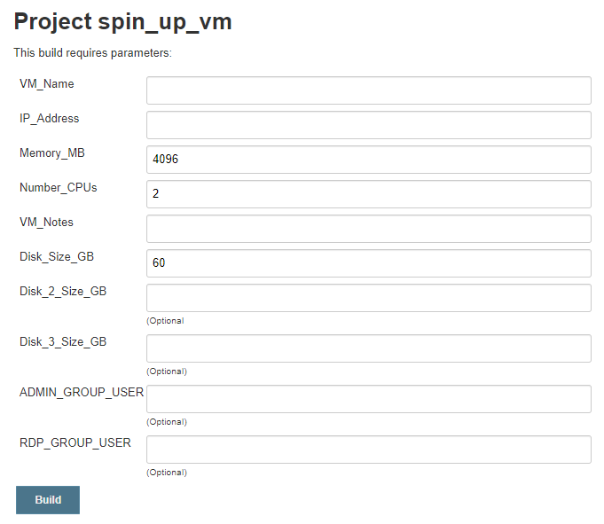
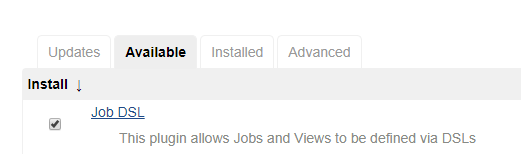
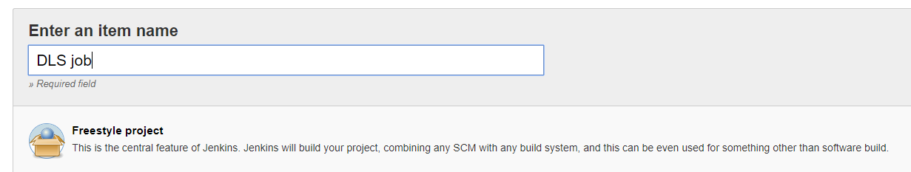
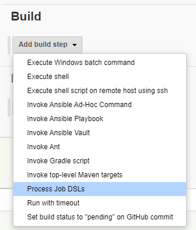
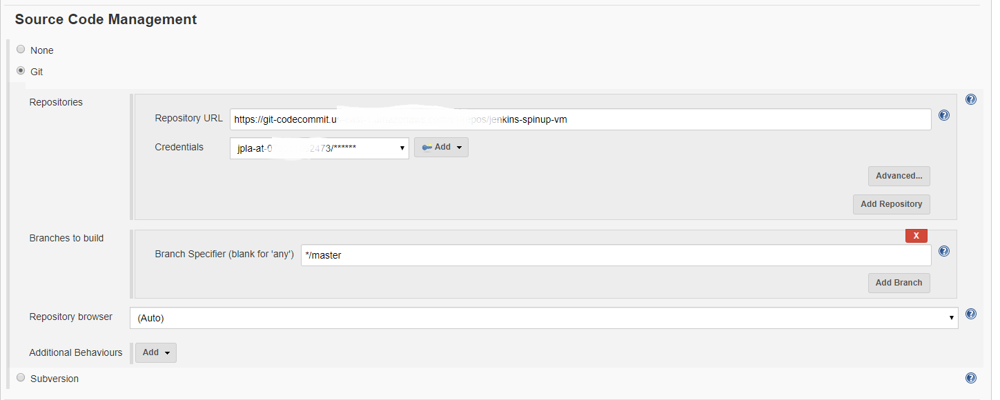
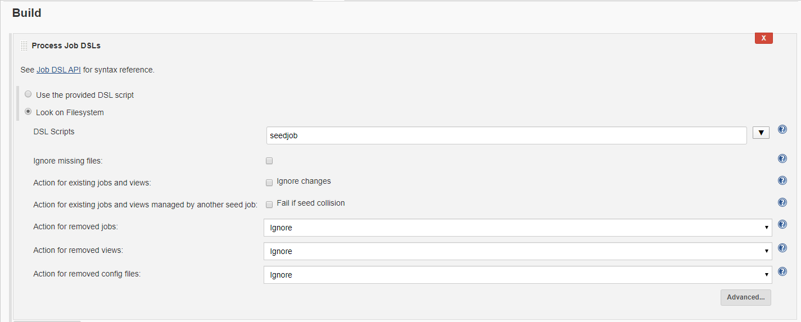
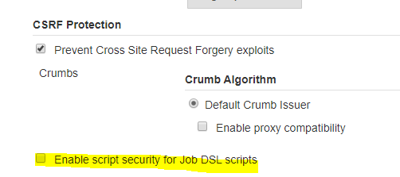

Spin up and configure Windows virtual machines in VMware environmnet
------------------------

This script allows you deploy and configure a virtual machine automatically in your VMware environment. The user would run the Jenkins Job as shown in the picture below. Then the Jenkins job executes Ansible playbooks to perform the different configuration tasks. 




**Jenkins Job Steps**

1. Download job's files from repository
2. Spin up virtual machine and join the VM to the Windows domain
3. Configure Window OS in the VM (expand drives, add users to admin and RDP groups, configure local administrator password)
4. Move VM to proper OU in AD


**Requirements**

* Have a Windows template ready
* Install [pyVmomi](https://github.com/vmware/pyvmomi) in Jenkins server
* Install [Kerbereos Library](https://docs.ansible.com/ansible/latest/user_guide/windows_winrm.html#installing-the-kerberos-library) in Jenkins server
* [Configure Kerberos](https://docs.ansible.com/ansible/latest/user_guide/windows_winrm.html#configuring-host-kerberos)
* Modify Ansible playbooks for your environment


**Create Jenkins DLS Job (Seed Job)**

The [Job DSL](https://plugins.jenkins.io/job-dsl/) plugin allows you to define Jenkins jobs as code. You will have to install this plugin and then configure the seed job. The [DSL job](seedjob) defined in this project will create the spin_up_vm job which is the one the user will run to deploy new virtual machines.   

Install Job DSL plugin



If you already have a seed job you just need to add the code in the file [seedjob](seedjob) to your existing job if not you need to create a new DSL job.





Speficy the repository URL where the seed job file will be located



Specify the name of the seed job file



You also need to disable the option shown below. (Manage Jenkins -> Configure Global Security) 



**Ansible Playbooks**

To deploy the VMs in the VMware environment, I am using the [vmware_guest](https://docs.ansible.com/ansible/latest/modules/vmware_guest_module.html) Ansible module. 

You will have to modify the Ansibe playbooks and other files with the information required for your environment (vCenter information, TCP/IP configuration, accounts, domain name). 

You need to encyrpt the passwords in the playbooks using Ansible Vault. 
```
ansible-playbook encrypt_string password123
```


**Configure Kerberos**

Ansible uses the pywinrm package to communicate with Windows servers over WinRM. I am using Kerberos for authentication since this is the recommended option for a domain environment.  
 
Once you have finished installing the [Kerberos library](https://docs.ansible.com/ansible/latest/user_guide/windows_winrm.html#installing-the-kerberos-library) and pywinrm[kerberos] you need to add your domain information in the real section of the Kerberos configuration file (/etc/krb5.conf)

```
[realms]
CONTOSO.CORP = {
                kdc = domain_controller_1_IP
                kdc = domain_controller_2_IP
                admin_server = domain_controller_1_IP
        }

[domain_realm]
.contoso.corp = CONTOSO.CORP
```

The Ansible host vars configured for Kerberos authentication are shown below
```
ansible_connection: winrm
ansible_winrm_transport: kerberos
ansible_port: 5985
ansible_user: admin-account@CONTOSO.CORP
ansible_password: password
```

